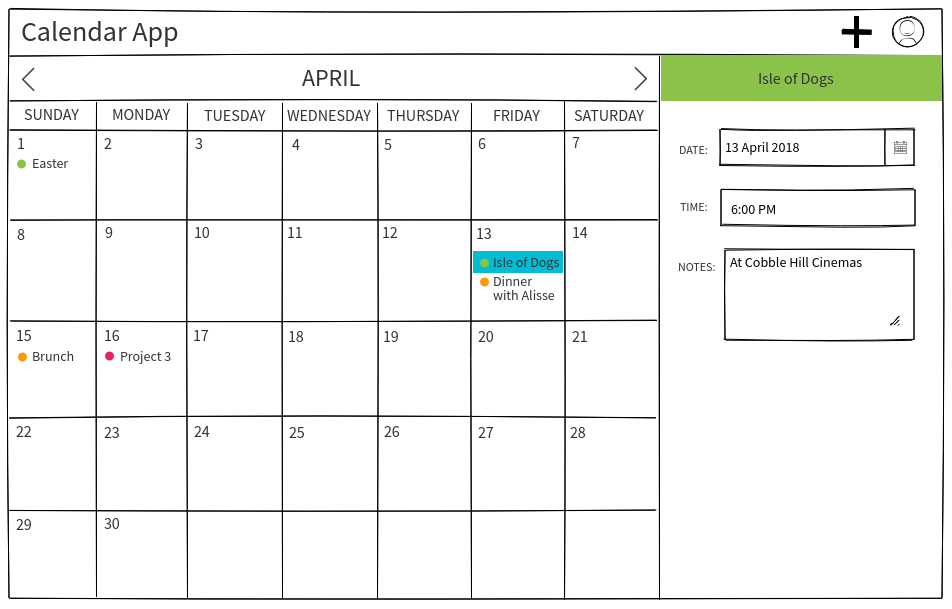
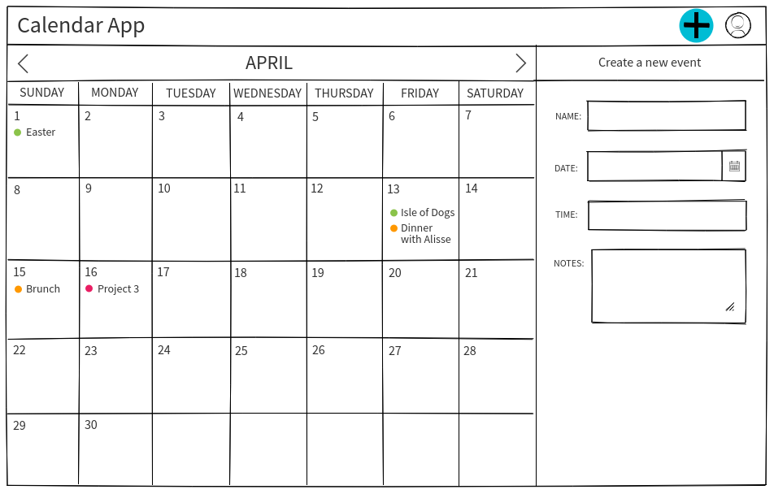

# Project 3 Calendar App
Our project is a calendar web app where users can create, edit, delete, and view upcoming and past events. The calendar's monthly view will remain constant (the user can toggle between months), while the side panel will change based on the user's actions. This allows the user to see all the events and the month as a whole, while also viewing any details or making changes. If a specific day is selected, the side panel will show all of the events on that day broken down by time. From there, the user can choose to edit or delete any of those events. Clicking on the edit button will render an edit form where the user can update information about their event including name, date, time, and any notes they might have. If the add button in the top nav bar is clicked, the side panel will render a create form where the user can create a new event.  

### Explanations of the technologies used
- `bluebird`
- `body-parser`
- `cors`
- `express`
- `pg-monitor`
- `pg-promise`

### Installation instructions for dependencies

### Unsolved problems or hurdles your team had to overcome

## General features:
- Monthly view — selecting a date would reveal more info about that day’s events
- Adding/creating events
- `moment.js` library for handling date localization
- User auth
- Potential 3rd party APIs: Google Calendar, Facebook Calendar, ESPN, Eventbrite (we’ll probably pick one if we have time)

## Models:
Event — handles calls to DB for CRUD on calendar events.

User — user login info, hashed passwords, session data.

## User stories:

- As a working parent of 4, I want a calendar app where I can keep track of different types of events (personal, professional) so I can see just one type of event when I want to.
- As someone who’s busiest day of the week is Wednesday, I want an app where I can just see my Wednesday schedule for the next few months so that I can plan for my busiest day of the week.
- As a private person, I want my calendar app to be something separate from my work email so that it doesn’t get synced with my work email.
- As a web developer with too many views already open, I hate having to check views in order to view more information about a specific date. I want an app where I can just see the information for a specific day by clicking on it in the monthly view without having to change views so that I don’t have to click back to get back to the monthly view.
- As someone who is always anxious about time, I would like to plan things to the minute, so I’m not nearly as stressed about timing.
- As a big picture kind of person, I would like to see all my events for the month, so I can plan new events accordingly.
- As someone who loves colors, I would like my calendar to NOT be bland, so my eyes don't bleed every time I look at it. :)
- As someone who hates the apple calendar desktop app I would like a desktop focused application so I can finally diverge from the default app.
- As a private person that’s worried about people seeing my schedule, I want a login button to maintain privacy.
- As a busy professional who’s schedule is always changing, I want to be able to delete, create, and delete my calendar to reflect my changing schedule.
- As someone who doesn’t like to have to log into google drive just to view their calendar, I want an app where my calendar is the first thing that pops up so that I can get right down to business.
- As an avid planner, I want to simultaneously see a monthly view while also being able to see details about a selected day’s events, so I can keep track of both and see them as a whole.
- As a busy person who checks their calendar on-the-go, I want to be able to color code my events by type, so that I can easily know which type of event I have coming up.

## DB Schema

## Wireframes
      

## Family Tree Diagram

